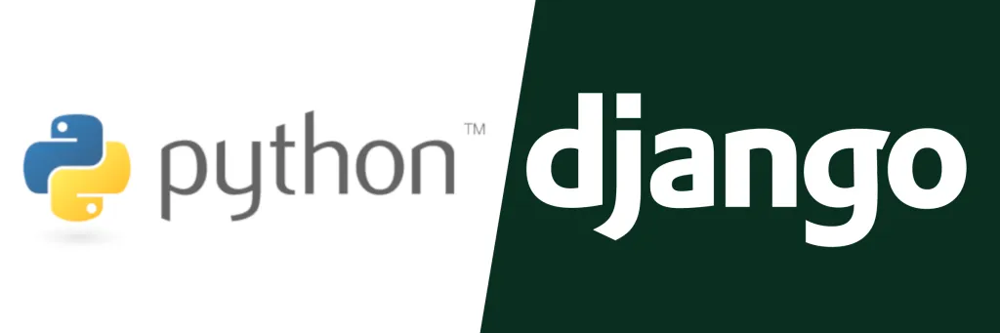
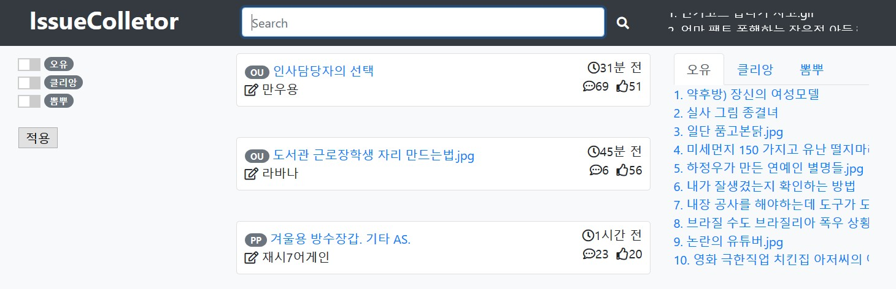
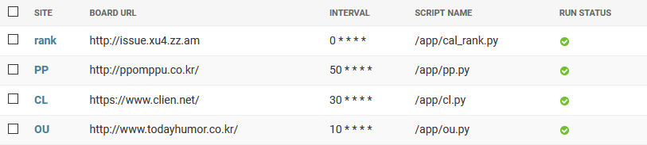

# 개발

## 개발환경
* 운영체제 : Windows10 / Ubuntu18.04(WSL)
* 언어 : Python3.6
* 웹 : Django2.2 / HTML5 / CSS3 / Bootstrap4 / JavaScript
* 데이터베이스 : Django ORM(SQLite)

## 패키지
* 수집 : requests / selenium
* 분석 : beautifulsoup4
* 스케쥴 : django-crontab
* 웹 : django-el-pagination

## 기능
### 홈페이지

인기글 정보/검색/정렬/순위 제공

### 관리페이지

인기글 수집/순위 관리