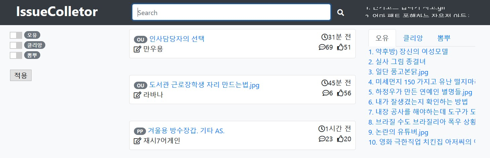

# 개요

IssueCollector는 각 커뮤니티의 인기글을 모아 한 페이지에서 정리해 보여주는 웹 어플리케이션입니다.

- 자동으로 여러 커뮤니티의 인기글을 수집하고, 인기글의 검색과 정렬 기능을 제공합니다.
- 수집된 정보를 기반으로 전체 인기글 순위, 커뮤니티별 인기글 순위를 계산하여 보여줍니다.
- 관리자 페이지를 제공하여 정보 관리, 정보 수집, 순위 계산을 제어할 수 있습니다.

IssueCollector의 목표는 커뮤니티에 노출되는 여러 글 중에서, 사용자가 원하는 방식으로 인기글을 모아 볼 수 있는 페이지를 제공하는 것 입니다.