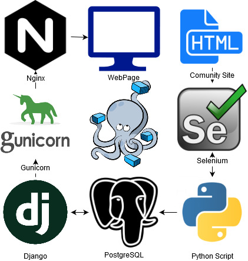
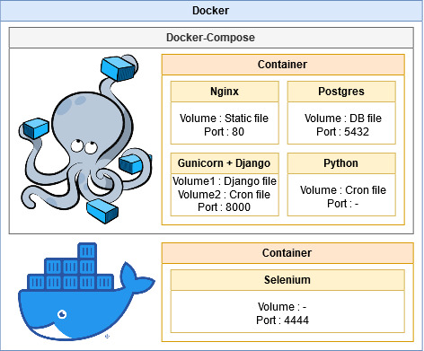
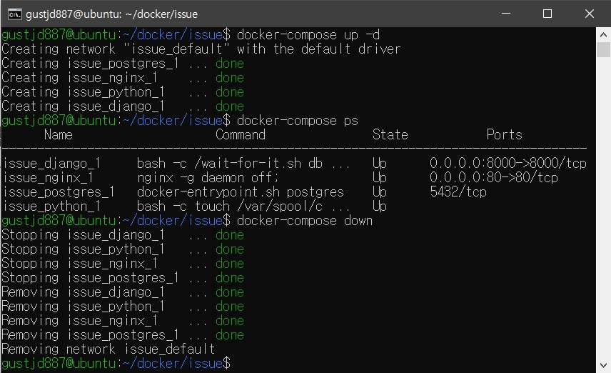

# 도커

Issue Collector 프로젝트의 서비스 배포를 위한 Docker 이미지 빌드

## 배포환경

- Ubuntu Server 19.10.1 arm64
- Docker 19.03.2
- Docker-compose 1.12.0

## 서비스 흐름

## 변경사항

- 웹서버 : Django Runserver > Nginx + Gunicorn
- 데이터베이스 : SQLite > PostgreSQL + Psycopg2
- 스케쥴링 : Django Crontab > Ubuntu Crontab

## 도커 이미지

- nginx:1.17.6
- python:3.8.1
- postgres:9.6.16
- selenium-standalone-chromium-pi:3.141.59-dubnium

## Docker-Compose 동작

