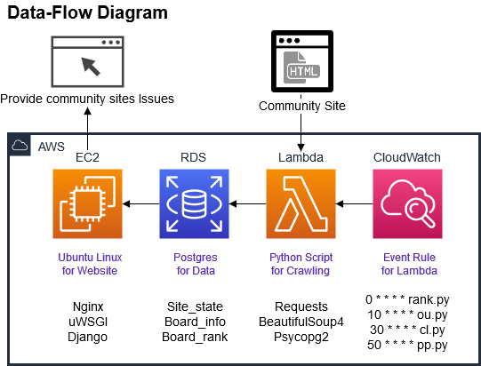

# 쿠버네티스

Issue Collector 프로젝트를 kubernetes 환경에 맞게 배포

## 배포환경

- 클라우드 : Oracle Cloud Instance, Bucket
- 운영체제 : Ubuntu 18.04 LTS * 2(master/worker)
- 쿠버네티스 : k3s v1.18.8+k3s1(kubernetes v1.18)

## 변경점

- 웹서버 : Nginx + Gunicorn + Django > Oracle Cloud Bucekt + Gunicorn + dajngo
- 데이터베이스 : Django ORM(Docker) > Django ORM(Containerd)
- 스케쥴링 : Docker Container Cron > Kubernetes Cronjob

## 서비스 구성

## 네트워크 구성

