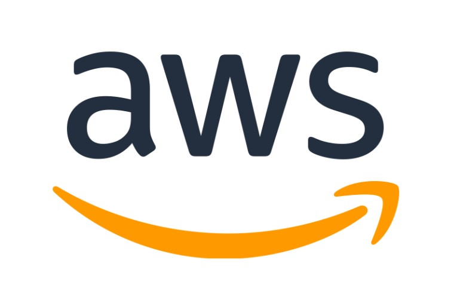
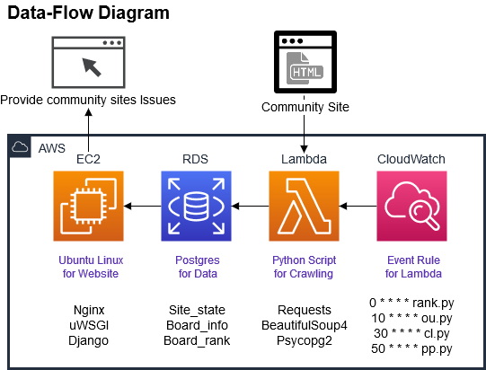
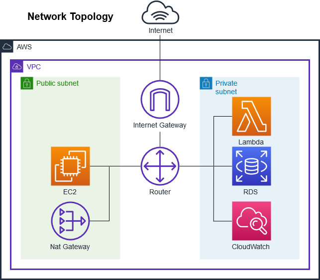

# 클라우드

Issue Collector 프로젝트를 AWS와 ORACLE CLOUD 환경에 맞게 수정 및 배포

## 배포환경

- EC2 : Ubuntu 16.04 LTS
- RDS : PostgreSQL11
- Lambda : Python3.6 + BeautifulSoup + Psycopg2
- CloudWatch : Lambda Scheduling

## 변경점

- 웹서버 : Django Runserver > Nginx + uWSGI + Django
- 데이터베이스 : Django ORM(SQLite) > Django ORM(PostreSQL) + Raw Query(Psycopg2)
- 스케쥴링 : Django Crontab > CloudWatch

## 서비스 구성

## 네트워크 구성

