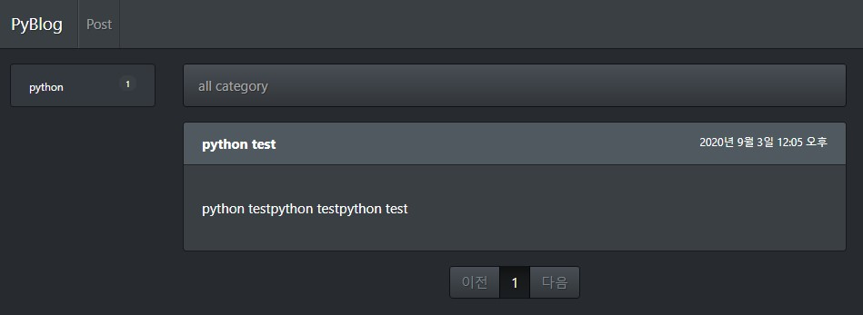

# 개요

Pyhotn과 Django 자료를 찾다보면 MkDocs로 제작되어 있는 튜토리얼이나 기술문서를 자주 볼 수 있습니다. MkDocs는 Markdown형식을 지원하는 정작 사이트 생성 도구이며, Github Pages에서 서비스 할 수 있기 때문에 접근성이 좋습니다. 하지만 마크다운 파일과 설정 파일들을 작성하고 빌드하여 GitHub Repository에 업로드하여 사이트가 최종 반영되는 과정을 거치기 때문에 초보자에게는 난이도가 있을 수 있습니다.

그래서 지금 Github Pages에서 사용하고 있는 MkDocs Material 테마와 Tistory 컨셉의 블로그 관리 사이트를 입맛에 맞게 제작하려고 합니다.

## 기능

- 포스트 작성
    - 관리자 작성 가능
    - 관리페이지 편집기 지원
- 게시판 생성
    - 사용자 작성 가능
    - 편집 폼 지원
- 카테고리 관리
    - 카테고리 메뉴 자동 생성
    - 카테고리 메뉴 노출 설정
- 마크다운 지원
    - TOC(Table Of Content) 기능 지원

## 배포
- Docker
    - Nginx
    - Gunicorn
    - Django
    - Postgres
